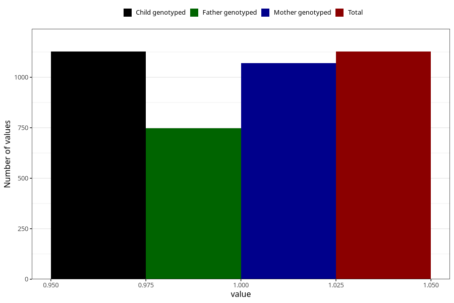

# throat_infection_13w_15w
Variable mapping to `AA359` in `Skjema1_v12`.
- Number of values:

| Value | Total | Child genotyped | Mother genotyped | Father genotyped |
| ----- | ----- | --------------- | ---------------- | ---------------- |
| Missing | 74181 | 74181 | 70579 | 49336 |
| Non-missing | 1127 | 1127 | 1071 | 748 |
| 1 | 1127 | 1127 | 1071 | 748 |

