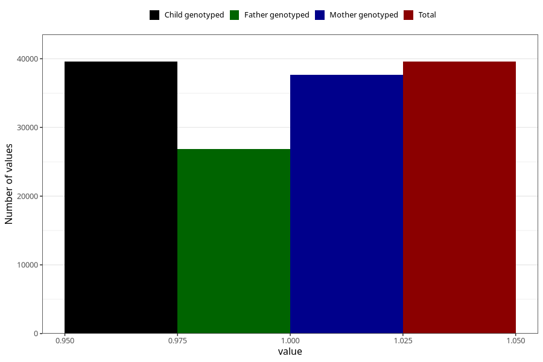

# unusual_tiredness_5w_8w
Variable mapping to `AA287` in `Skjema1_v12`.
- Number of values:

| Value | Total | Child genotyped | Mother genotyped | Father genotyped |
| ----- | ----- | --------------- | ---------------- | ---------------- |
| Missing | 35731 | 35731 | 33955 | 23215 |
| Non-missing | 39577 | 39577 | 37695 | 26869 |
| 1 | 39577 | 39577 | 37695 | 26869 |

