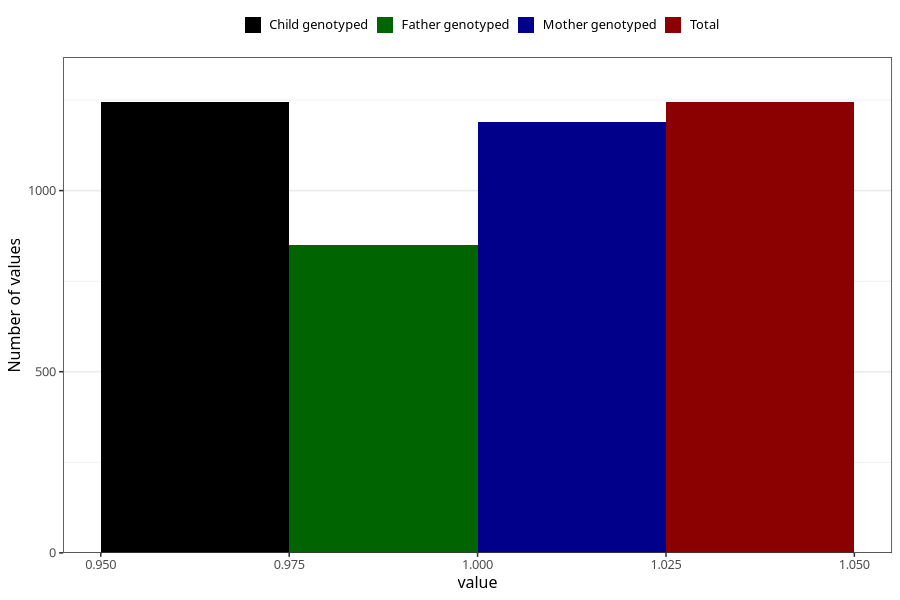

# vaginal_bleeding_1_25w_28w
Variable mapping to `CC320` in `Skjema3_v12`.
- Number of values:

| Value | Total | Child genotyped | Mother genotyped | Father genotyped |
| ----- | ----- | --------------- | ---------------- | ---------------- |
| Missing | 74064 | 74064 | 70460 | 49233 |
| Non-missing | 1244 | 1244 | 1190 | 851 |
| 1 | 1244 | 1244 | 1190 | 851 |

