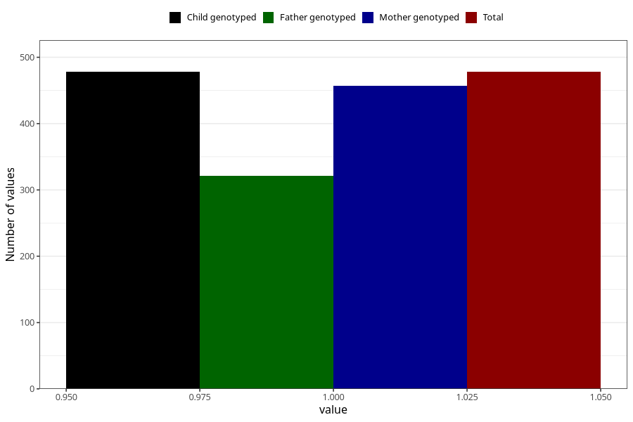

# vaginal_bleeding_2_17w_20w
Variable mapping to `CC325` in `Skjema3_v12`.
- Number of values:

| Value | Total | Child genotyped | Mother genotyped | Father genotyped |
| ----- | ----- | --------------- | ---------------- | ---------------- |
| Missing | 74830 | 74830 | 71193 | 49763 |
| Non-missing | 478 | 478 | 457 | 321 |
| 1 | 478 | 478 | 457 | 321 |

