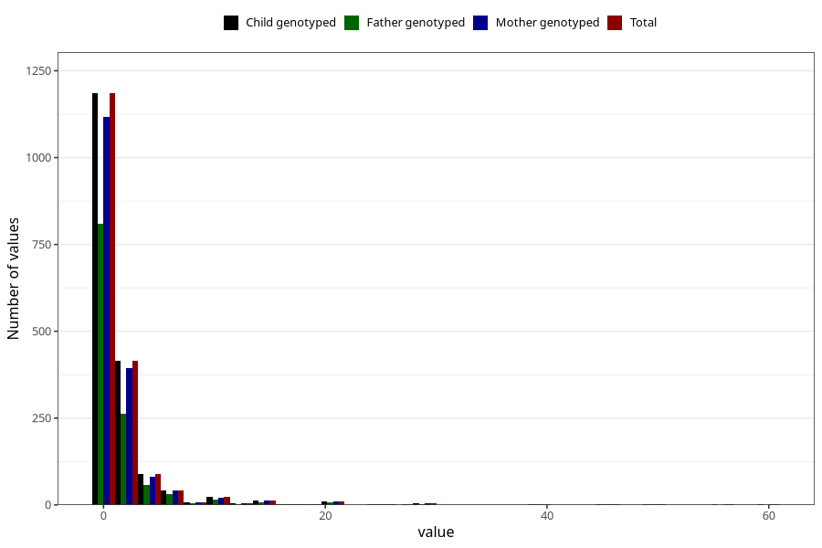

# vaginal_bleeding_2_duration
Variable mapping to `CC329` in `Skjema3_v12`.
- Number of values:

| Value | Total | Child genotyped | Mother genotyped | Father genotyped |
| ----- | ----- | --------------- | ---------------- | ---------------- |
| Missing | 73499 | 73499 | 69938 | 48874 |
| Non-missing | 1809 | 1809 | 1712 | 1210 |
| 25th percentile | 1 | 1 | 1 | 1 |
| 50th percentile | 1 | 1 | 1 | 1 |
| 75th percentile | 2 | 2 | 2 | 2 |
| Mean | 2.30403537866224 | 2.30403537866224 | 2.33586448598131 | 2.2396694214876 |
| Standard deviation | 4.28226821860714 | 4.28226821860714 | 4.38075849100287 | 4.03628044832644 |
| N | 1809 | 1809 | 1712 | 1210 |

