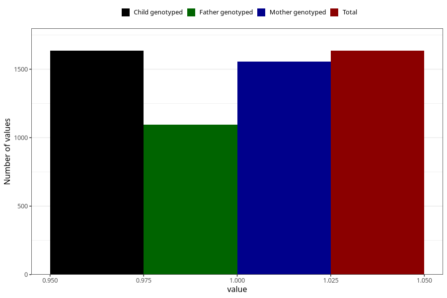

# vaginal_catarrh_unusual_discharge_21w_24w
Variable mapping to `CC414` in `Skjema3_v12`.
- Number of values:

| Value | Total | Child genotyped | Mother genotyped | Father genotyped |
| ----- | ----- | --------------- | ---------------- | ---------------- |
| Missing | 73673 | 73673 | 70093 | 48988 |
| Non-missing | 1635 | 1635 | 1557 | 1096 |
| 1 | 1635 | 1635 | 1557 | 1096 |

