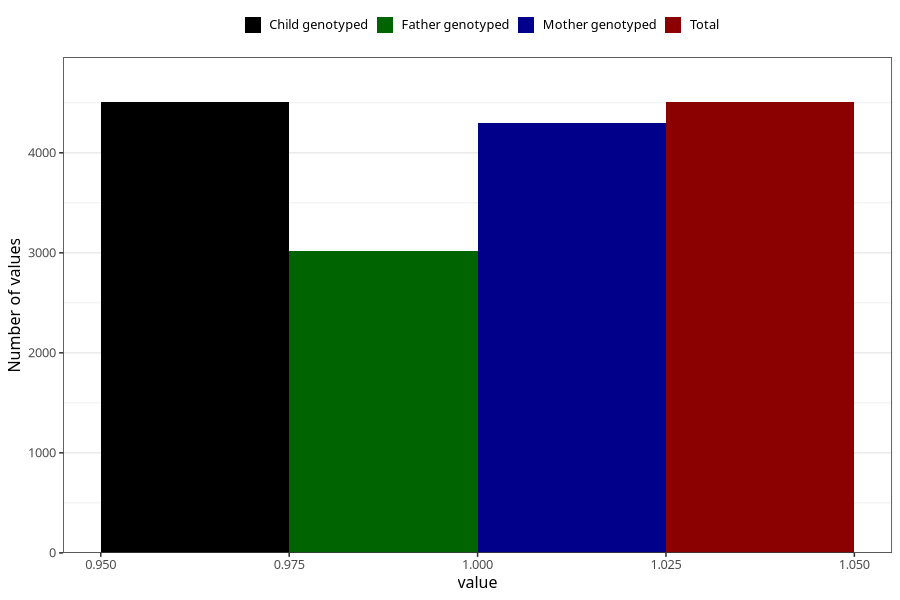

# vaginal_thrush_13w_16w
Variable mapping to `CC400` in `Skjema3_v12`.
- Number of values:

| Value | Total | Child genotyped | Mother genotyped | Father genotyped |
| ----- | ----- | --------------- | ---------------- | ---------------- |
| Missing | 70802 | 70802 | 67348 | 47064 |
| Non-missing | 4506 | 4506 | 4302 | 3020 |
| 1 | 4506 | 4506 | 4302 | 3020 |

