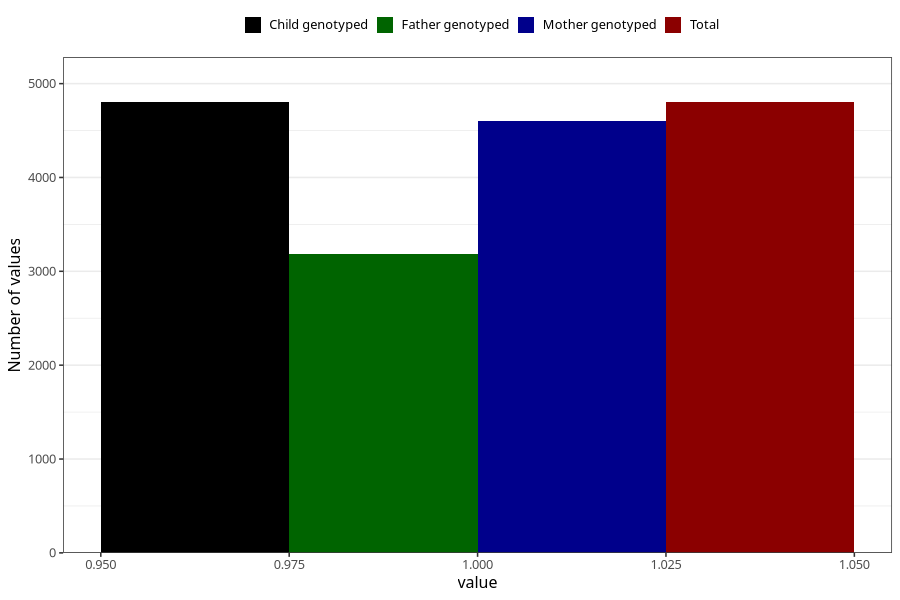

# vaginal_thrush_17w_20w
Variable mapping to `CC401` in `Skjema3_v12`.
- Number of values:

| Value | Total | Child genotyped | Mother genotyped | Father genotyped |
| ----- | ----- | --------------- | ---------------- | ---------------- |
| Missing | 70506 | 70506 | 67053 | 46897 |
| Non-missing | 4802 | 4802 | 4597 | 3187 |
| 1 | 4802 | 4802 | 4597 | 3187 |

