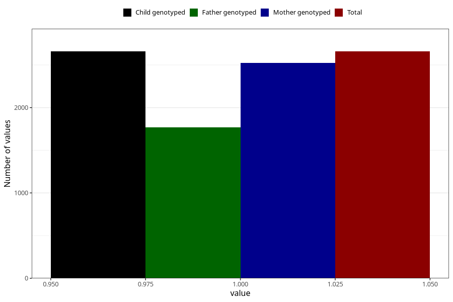

# vaginal_thrush_before_4w
Variable mapping to `AA236` in `Skjema1_v12`.
- Number of values:

| Value | Total | Child genotyped | Mother genotyped | Father genotyped |
| ----- | ----- | --------------- | ---------------- | ---------------- |
| Missing | 72650 | 72650 | 69126 | 48315 |
| Non-missing | 2658 | 2658 | 2524 | 1769 |
| 1 | 2658 | 2658 | 2524 | 1769 |

