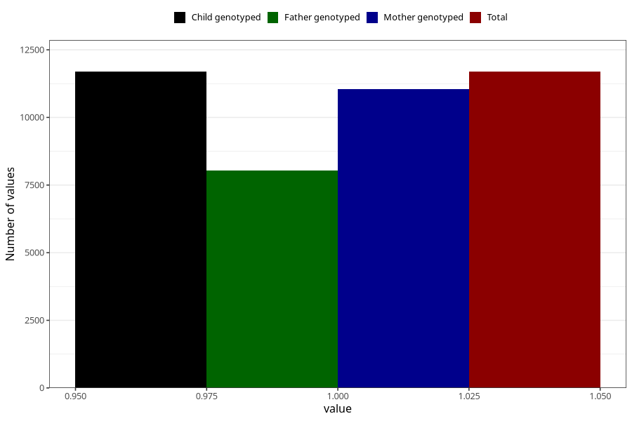

# vomiting_13w_15w
Variable mapping to `AA229` in `Skjema1_v12`.
- Number of values:

| Value | Total | Child genotyped | Mother genotyped | Father genotyped |
| ----- | ----- | --------------- | ---------------- | ---------------- |
| Missing | 63618 | 63618 | 60601 | 42058 |
| Non-missing | 11690 | 11690 | 11049 | 8026 |
| 1 | 11690 | 11690 | 11049 | 8026 |

