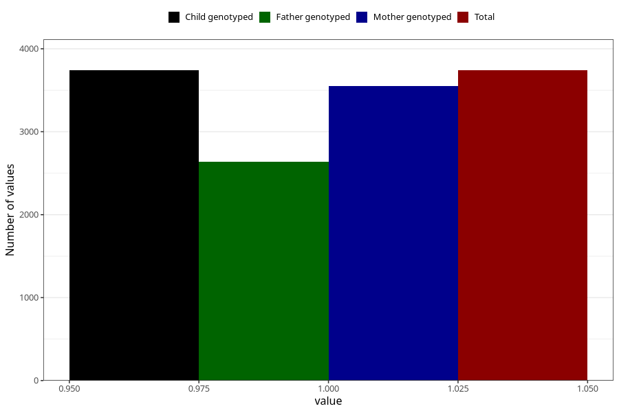

# vomiting_week_still_q2
Variable mapping to `BB859` in `Skjema2CDW_v12`.
- Number of values:

| Value | Total | Child genotyped | Mother genotyped | Father genotyped |
| ----- | ----- | --------------- | ---------------- | ---------------- |
| Missing | 71568 | 71568 | 68101 | 47449 |
| Non-missing | 3740 | 3740 | 3549 | 2635 |
| 1 | 3740 | 3740 | 3549 | 2635 |

