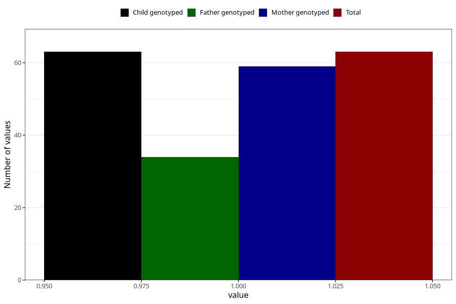

# coffee_boiled_decaf
Variable mapping to `AA1385` in `Skjema1_v12`.
- Number of values:

| Value | Total | Child genotyped | Mother genotyped | Father genotyped |
| ----- | ----- | --------------- | ---------------- | ---------------- |
| Missing | 75245 | 75245 | 71591 | 50050 |
| Non-missing | 63 | 63 | 59 | 34 |
| 1 | 63 | 63 | 59 | 34 |

