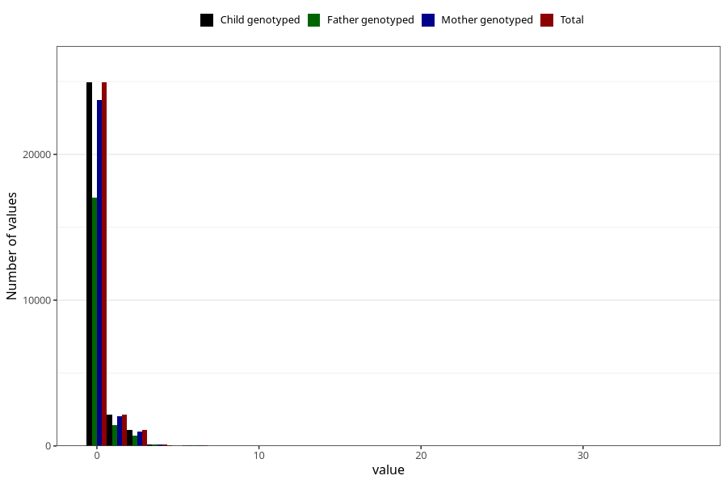

# coffee_during_instant
Variable mapping to `AA1381` in `Skjema1_v12`.
- Number of values:

| Value | Total | Child genotyped | Mother genotyped | Father genotyped |
| ----- | ----- | --------------- | ---------------- | ---------------- |
| Missing | 46927 | 46927 | 44659 | 30756 |
| Non-missing | 28381 | 28381 | 26991 | 19328 |
| 0 | 24935 | 24935 | 23722 | 17047 |
| 1 | 2159 | 2159 | 2054 | 1451 |
| 2 | 937 | 937 | 886 | 611 |
| 3 | 137 | 137 | 130 | 84 |
| 4 | 123 | 123 | 117 | 77 |
| 5 | 23 | 23 | 20 | 18 |
| 6 | 43 | 43 | 41 | 28 |
| 7 | 6 | 6 | 4 | 4 |
| 8 | 8 | 8 | 8 | 4 |
| 10 | 7 | 7 | 6 | 3 |
| 14 | 1 | 1 | 1 | 1 |
| 24 | 1 | 1 | 1 | 0 |
| 36 | 1 | 1 | 1 | 0 |

