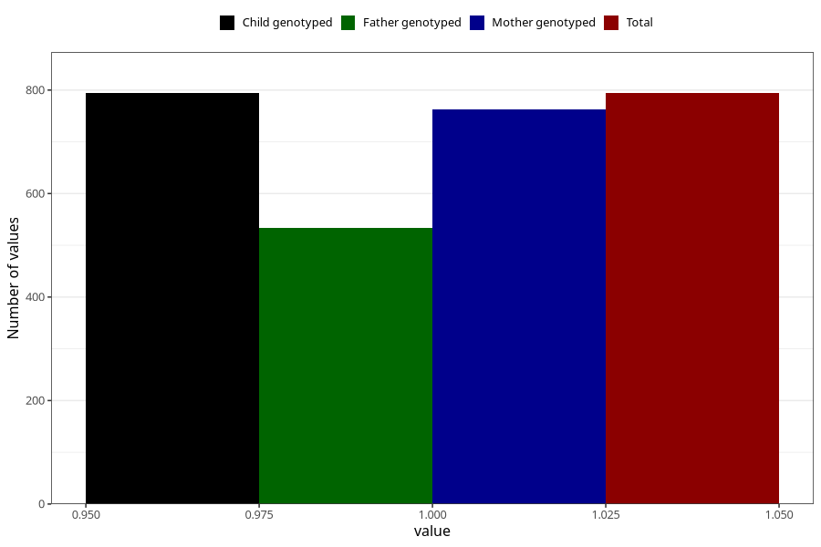

# coffee_instant_decaf
Variable mapping to `AA1382` in `Skjema1_v12`.
- Number of values:

| Value | Total | Child genotyped | Mother genotyped | Father genotyped |
| ----- | ----- | --------------- | ---------------- | ---------------- |
| Missing | 74514 | 74514 | 70888 | 49551 |
| Non-missing | 794 | 794 | 762 | 533 |
| 1 | 794 | 794 | 762 | 533 |

