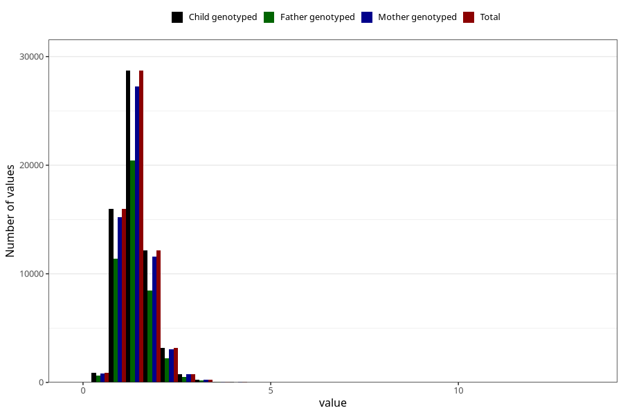

# copper
Variable mapping to `KOPPER` in `Skjema2_beregning_CDW_v12`.
- Number of values:

| Value | Total | Child genotyped | Mother genotyped | Father genotyped |
| ----- | ----- | --------------- | ---------------- | ---------------- |
| Missing | 13178 | 13178 | 12654 | 6217 |
| Non-missing | 62130 | 62130 | 58996 | 43867 |
| 25th percentile | 1.12 | 1.12 | 1.12 | 1.12 |
| 50th percentile | 1.35 | 1.35 | 1.35 | 1.35 |
| 75th percentile | 1.63 | 1.63 | 1.63 | 1.62 |
| Mean | 1.41254707870594 | 1.41254707870594 | 1.41178707030985 | 1.40602252262521 |
| Standard deviation | 0.449842961018678 | 0.449842961018678 | 0.44839068467712 | 0.441034154019102 |
| N | 62130 | 62130 | 58996 | 43867 |

