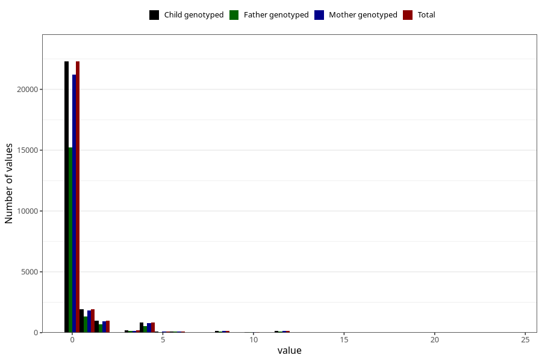

# diet_soda_before
Variable mapping to `AA1401` in `Skjema1_v12`.
- Number of values:

| Value | Total | Child genotyped | Mother genotyped | Father genotyped |
| ----- | ----- | --------------- | ---------------- | ---------------- |
| Missing | 48604 | 48604 | 46251 | 31805 |
| Non-missing | 26704 | 26704 | 25399 | 18279 |
| Consumption have been reported by a mark but no amount given | 3 | 3 | 3 |2 |
| 0 | 22289 | 22289 | 21209 | 15243 |
| 1 | 1904 | 1904 | 1801 | 1340 |
| 2 | 969 | 969 | 920 | 671 |
| 3 | 171 | 171 | 163 | 124 |
| 4 | 824 | 824 | 790 | 550 |
| 5 | 74 | 74 | 70 | 40 |
| 6 | 105 | 105 | 102 | 76 |
| 7 | 15 | 15 | 15 | 9 |
| 8 | 126 | 126 | 119 | 77 |
| 9 | 5 | 5 | 5 | 5 |
| 10 | 53 | 53 | 50 | 28 |
| 12 | 146 | 146 | 133 | 98 |
| 14 | 1 | 1 | 1 | 1 |
| 15 | 2 | 2 | 1 | 1 |
| 16 | 7 | 7 | 7 | 5 |
| 18 | 4 | 4 | 4 | 3 |
| 20 | 2 | 2 | 2 | 2 |
| 24 | 4 | 4 | 4 | 4 |

