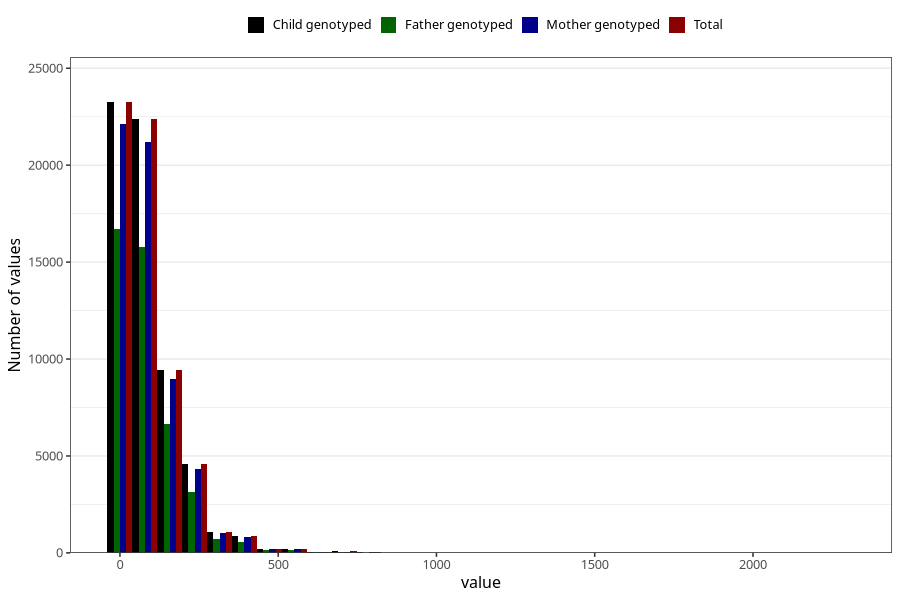

# food_caffeine_total
Variable mapping to `f_caff_tot` in `Skjema2_beregning_CDW_caffeine_food_and_supplements_v12`.
- Number of values:

| Value | Total | Child genotyped | Mother genotyped | Father genotyped |
| ----- | ----- | --------------- | ---------------- | ---------------- |
| Missing | 13178 | 13178 | 12654 | 6217 |
| Non-missing | 62130 | 62130 | 58996 | 43867 |
| 25th percentile | 23.381775 | 23.381775 | 23.387475 | 22.952 |
| 50th percentile | 59.60085 | 59.60085 | 59.40265 | 58.1216 |
| 75th percentile | 124.3182 | 124.3182 | 124.1632 | 121.70925 |
| Mean | 89.9923121986158 | 89.9923121986158 | 89.8778612668656 | 87.6018678756241 |
| Standard deviation | 94.5170030726673 | 94.5170030726673 | 94.5199649812313 | 91.2979916675225 |
| N | 62130 | 62130 | 58996 | 43867 |

