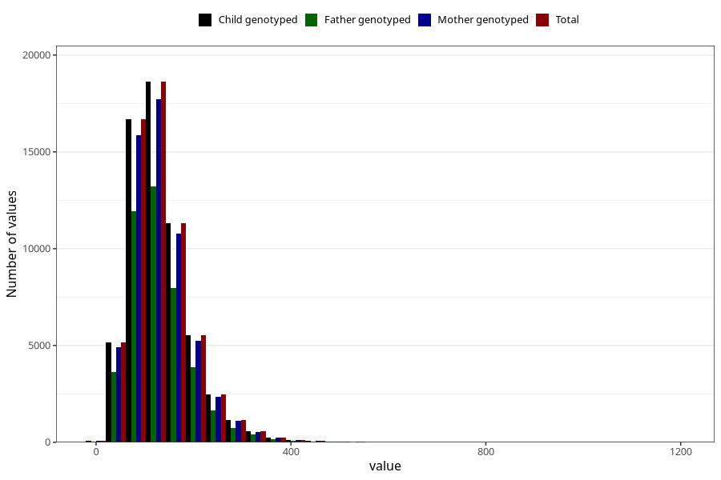

# food_iodine_mcg_day
Variable mapping to `f_jod` in `Skjema2_beregning_CDW_foody_fatty_acid_and_iodine_v12`.
- Number of values:

| Value | Total | Child genotyped | Mother genotyped | Father genotyped |
| ----- | ----- | --------------- | ---------------- | ---------------- |
| Missing | 13178 | 13178 | 12654 | 6217 |
| Non-missing | 62130 | 62130 | 58996 | 43867 |
| 25th percentile | 88.7146 | 88.7146 | 88.703925 | 88.37345 |
| 50th percentile | 121.4321 | 121.4321 | 121.43975 | 120.6131 |
| 75th percentile | 161.84275 | 161.84275 | 161.660525 | 160.6672 |
| Mean | 132.445360199582 | 132.445360199582 | 132.340249799986 | 131.308657779196 |
| Standard deviation | 65.2486906487461 | 65.2486906487461 | 65.1653649508665 | 64.0208328386581 |
| N | 62130 | 62130 | 58996 | 43867 |

