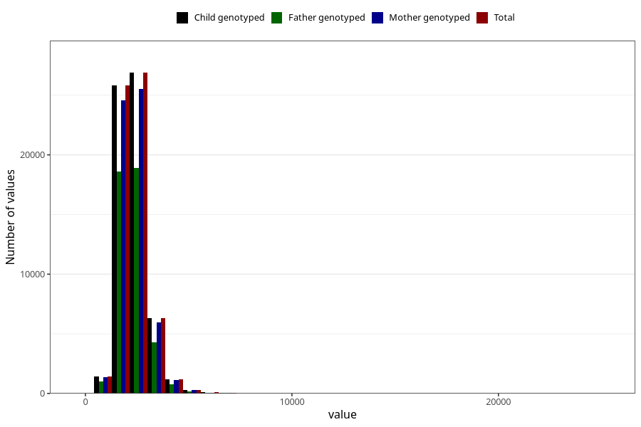

# kcal
Variable mapping to `KCAL` in `Skjema2_beregning_CDW_v12`.
- Number of values:

| Value | Total | Child genotyped | Mother genotyped | Father genotyped |
| ----- | ----- | --------------- | ---------------- | ---------------- |
| Missing | 13178 | 13178 | 12654 | 6217 |
| Non-missing | 62130 | 62130 | 58996 | 43867 |
| 25th percentile | 1878.4025 | 1878.4025 | 1877.7175 | 1869.86 |
| 50th percentile | 2229.115 | 2229.115 | 2227.98 | 2215.44 |
| 75th percentile | 2653.075 | 2653.075 | 2652.34 | 2635.02 |
| Mean | 2327.70417914051 | 2327.70417914051 | 2326.32577361177 | 2309.23429388834 |
| Standard deviation | 716.235141330475 | 716.235141330475 | 713.225326855276 | 695.013296769828 |
| N | 62130 | 62130 | 58996 | 43867 |

