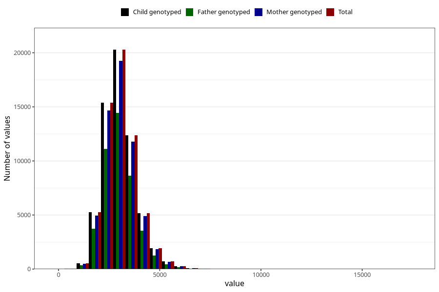

# sodium
Variable mapping to `NATRIUM` in `Skjema2_beregning_CDW_v12`.
- Number of values:

| Value | Total | Child genotyped | Mother genotyped | Father genotyped |
| ----- | ----- | --------------- | ---------------- | ---------------- |
| Missing | 13178 | 13178 | 12654 | 6217 |
| Non-missing | 62130 | 62130 | 58996 | 43867 |
| 25th percentile | 2524.1925 | 2524.1925 | 2524.1725 | 2517.065 |
| 50th percentile | 2977.275 | 2977.275 | 2976.99 | 2963.21 |
| 75th percentile | 3501.15 | 3501.15 | 3499.45 | 3476.915 |
| Mean | 3063.78965041043 | 3063.78965041043 | 3062.58134483694 | 3045.86175143046 |
| Standard deviation | 821.746184006578 | 821.746184006578 | 818.971247304699 | 804.74793807286 |
| N | 62130 | 62130 | 58996 | 43867 |

