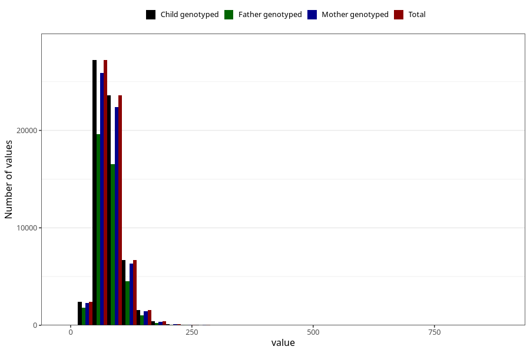

# tot_fat
Variable mapping to `TOT_FETT` in `Skjema2_beregning_CDW_v12`.
- Number of values:

| Value | Total | Child genotyped | Mother genotyped | Father genotyped |
| ----- | ----- | --------------- | ---------------- | ---------------- |
| Missing | 13178 | 13178 | 12654 | 6217 |
| Non-missing | 62130 | 62130 | 58996 | 43867 |
| 25th percentile | 63.12 | 63.12 | 63.11 | 62.73 |
| 50th percentile | 76.84 | 76.84 | 76.82 | 76.22 |
| 75th percentile | 93.81 | 93.81 | 93.77 | 92.94 |
| Mean | 81.0353875744407 | 81.0353875744407 | 80.9852944267408 | 80.2616219481615 |
| Standard deviation | 27.5761078476366 | 27.5761078476366 | 27.4974691797055 | 26.9017871170513 |
| N | 62130 | 62130 | 58996 | 43867 |

