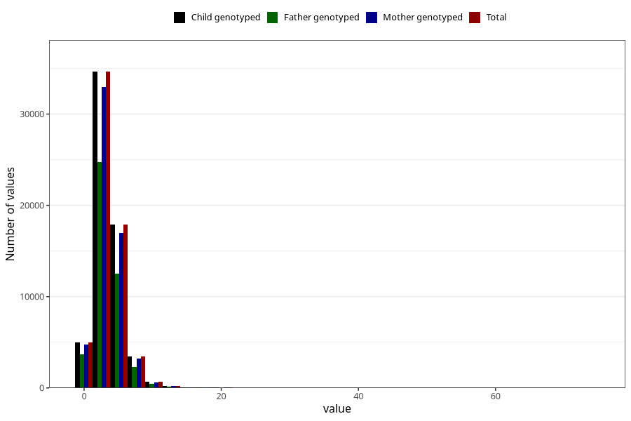

# vitamin_d
Variable mapping to `VIT_D` in `Skjema2_beregning_CDW_v12`.
- Number of values:

| Value | Total | Child genotyped | Mother genotyped | Father genotyped |
| ----- | ----- | --------------- | ---------------- | ---------------- |
| Missing | 13178 | 13178 | 12654 | 6217 |
| Non-missing | 62130 | 62130 | 58996 | 43867 |
| 25th percentile | 2.13 | 2.13 | 2.13 | 2.11 |
| 50th percentile | 3.19 | 3.19 | 3.19 | 3.15 |
| 75th percentile | 4.44 | 4.44 | 4.43 | 4.4 |
| Mean | 3.54693449219379 | 3.54693449219379 | 3.54119736931317 | 3.50179519912463 |
| Standard deviation | 2.35712792100465 | 2.35712792100465 | 2.35242579433541 | 2.33735185901788 |
| N | 62130 | 62130 | 58996 | 43867 |

