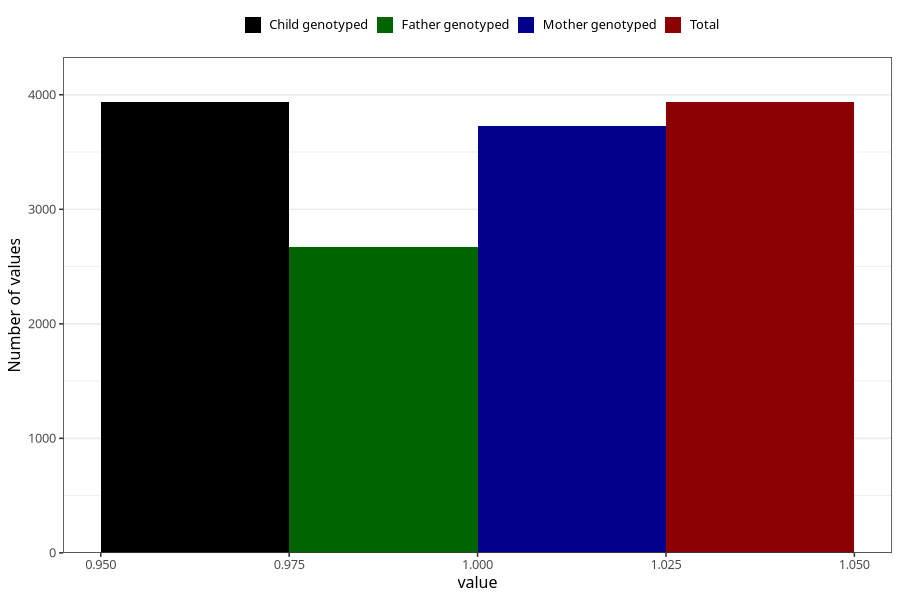

# lost_periods_yes_other
Variable mapping to `AA19` in `Skjema1_v12`.
- Number of values:

| Value | Total | Child genotyped | Mother genotyped | Father genotyped |
| ----- | ----- | --------------- | ---------------- | ---------------- |
| Missing | 71373 | 71373 | 67924 | 47411 |
| Non-missing | 3935 | 3935 | 3726 | 2673 |
| 1 | 3935 | 3935 | 3726 | 2673 |

