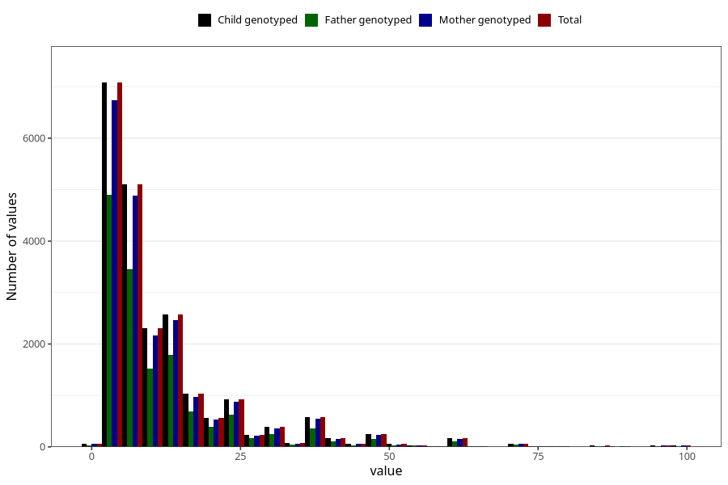

# months_intercourse_without_contraception_2
Variable mapping to `AA48` in `Skjema1_v12`.
- Number of values:

| Value | Total | Child genotyped | Mother genotyped | Father genotyped |
| ----- | ----- | --------------- | ---------------- | ---------------- |
| Missing | 53463 | 53463 | 50844 | 35286 |
| Non-missing | 21845 | 21845 | 20806 | 14798 |
| 25th percentile | 5 | 5 | 5 | 5 |
| 50th percentile | 7 | 7 | 7 | 7 |
| 75th percentile | 14 | 14 | 14 | 13 |
| Mean | 12.1188372625315 | 12.1188372625315 | 12.1399115639719 | 11.8864035680497 |
| Standard deviation | 12.533203472074 | 12.533203472074 | 12.594745888887 | 12.1816189065114 |
| N | 21845 | 21845 | 20806 | 14798 |

