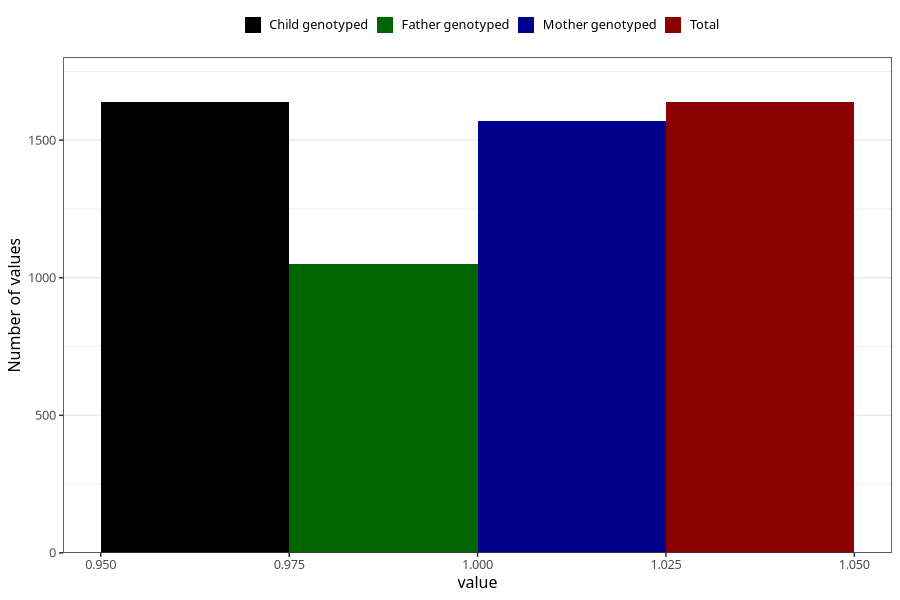

# treated_for_infertility_previous_hormone_treatment
Variable mapping to `AA74` in `Skjema1_v12`.
- Number of values:

| Value | Total | Child genotyped | Mother genotyped | Father genotyped |
| ----- | ----- | --------------- | ---------------- | ---------------- |
| Missing | 73670 | 73670 | 70081 | 49034 |
| Non-missing | 1638 | 1638 | 1569 | 1050 |
| 1 | 1638 | 1638 | 1569 | 1050 |

