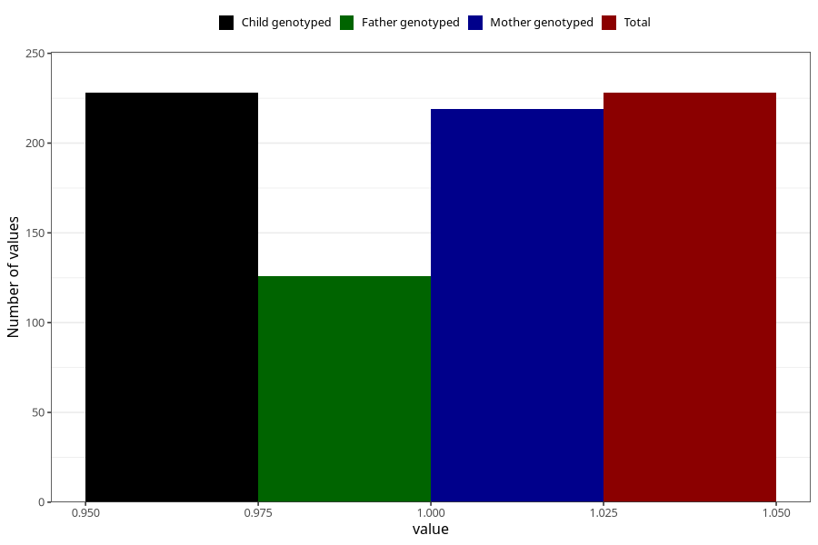

# treated_for_infertility_previous_insemination
Variable mapping to `AA76` in `Skjema1_v12`.
- Number of values:

| Value | Total | Child genotyped | Mother genotyped | Father genotyped |
| ----- | ----- | --------------- | ---------------- | ---------------- |
| Missing | 75080 | 75080 | 71431 | 49958 |
| Non-missing | 228 | 228 | 219 | 126 |
| 1 | 228 | 228 | 219 | 126 |

