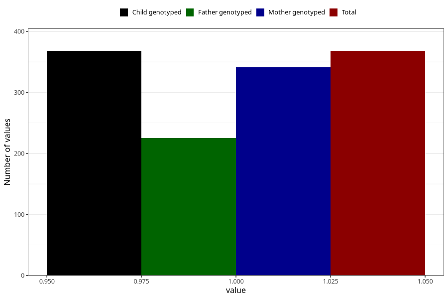

# treated_for_infertility_previous_other
Variable mapping to `AA80` in `Skjema1_v12`.
- Number of values:

| Value | Total | Child genotyped | Mother genotyped | Father genotyped |
| ----- | ----- | --------------- | ---------------- | ---------------- |
| Missing | 74940 | 74940 | 71309 | 49859 |
| Non-missing | 368 | 368 | 341 | 225 |
| 1 | 368 | 368 | 341 | 225 |

