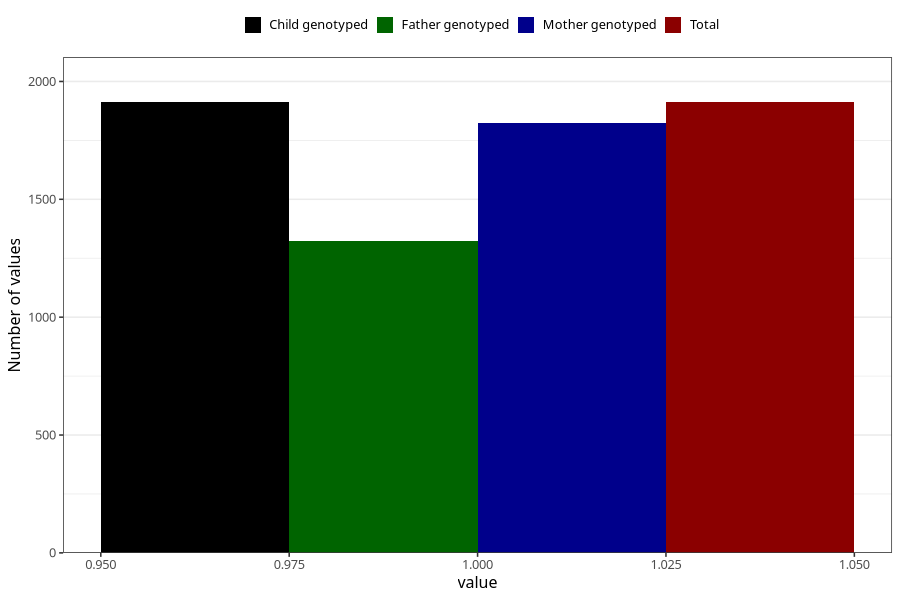

# treated_for_infertility_test_tube
Variable mapping to `AA79` in `Skjema1_v12`.
- Number of values:

| Value | Total | Child genotyped | Mother genotyped | Father genotyped |
| ----- | ----- | --------------- | ---------------- | ---------------- |
| Missing | 73396 | 73396 | 69825 | 48760 |
| Non-missing | 1912 | 1912 | 1825 | 1324 |
| 1 | 1912 | 1912 | 1825 | 1324 |

