# Phenotypes
### Number of values

### Length vs weight

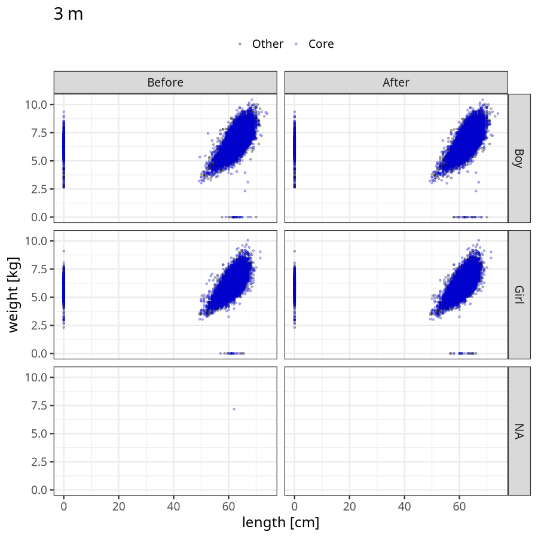
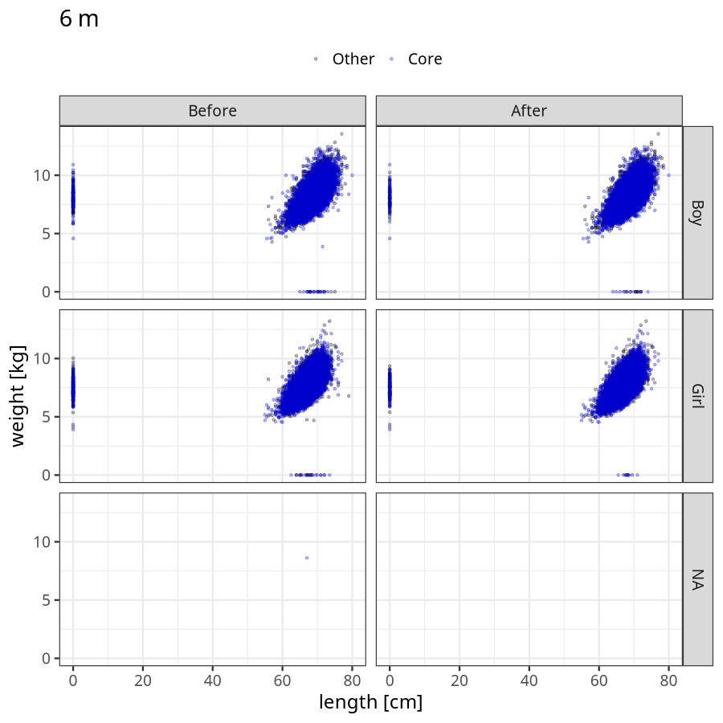

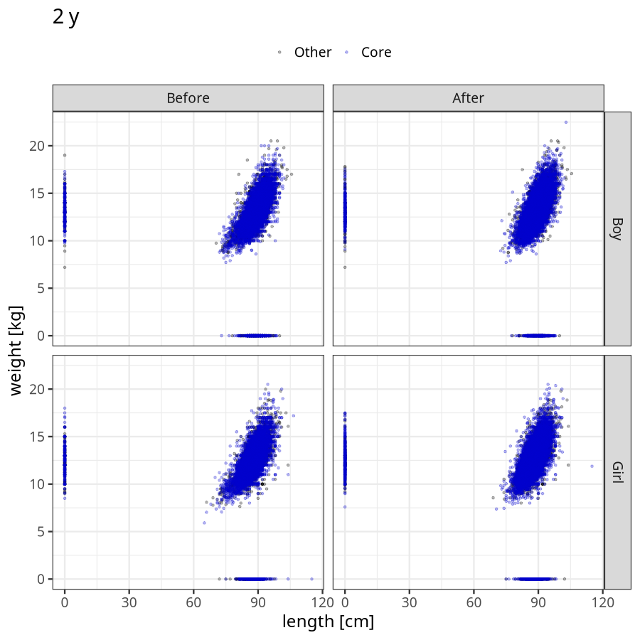

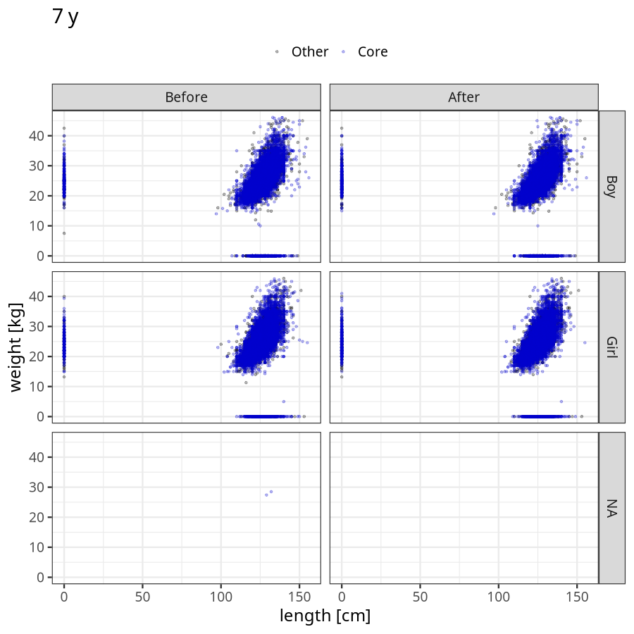

### Imputation
- Children with no data point altered: 43024
- Children with at least one data point altered: 32265
#### Random example: 73616
> outlier@length_2y imputed@length_2y

#### Random example: 34863
> outlier@length_2y imputed@length_2y

#### Random example: 74187
> outlier@length_2y imputed@length_2y

#### Random example: 14770
> outlier@length_2y imputed@length_2y

#### Random example: 20439
> outlier@length_2y imputed@length_2y

#### Random example: 31144
> outlier@length_2y imputed@length_2y

#### Random example: 44280
> outlier@length_2y imputed@length_2y

#### Random example: 16754
> outlier@length_2y imputed@length_2y

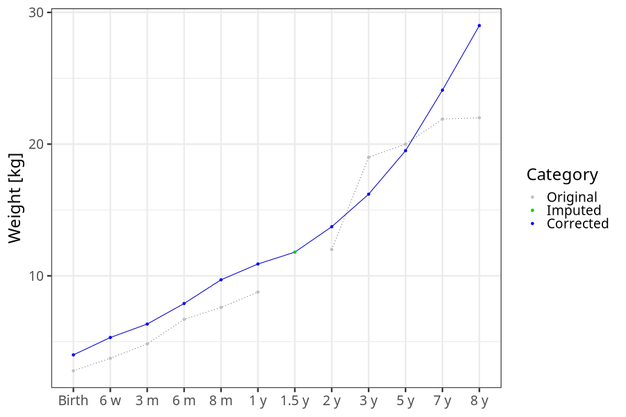
#### Random example: 46892
> outlier@length_2y imputed@length_2y

#### Random example: 38136
> outlier@length_2y imputed@length_2y

#### Random example: 9322
> outlier@length_2y imputed@length_2y

#### Random example: 23269
> outlier@length_2y imputed@length_2y

#### Random example: 34412
> outlier@length_2y imputed@length_2y

#### Random example: 14478
> outlier@length_2y imputed@length_2y

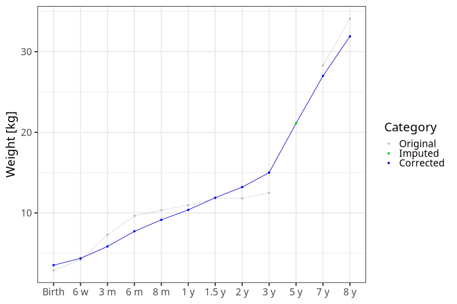
#### Random example: 60529
> outlier@length_2y imputed@length_2y

#### Random example: 74481
> outlier@length_2y imputed@length_2y

#### Random example: 35486
> outlier@length_2y imputed@length_2y

#### Random example: 36418
> outlier@length_2y imputed@length_2y

#### Random example: 15607
> outlier@length_2y imputed@length_2y

#### Random example: 74446
> outlier@length_2y imputed@length_2y

#### Most extreme example (1): 36412
> 

#### Most extreme example (2): 69229
> imputed@length_16m imputed@length_2y imputed@weight_16m imputed@weight_2y

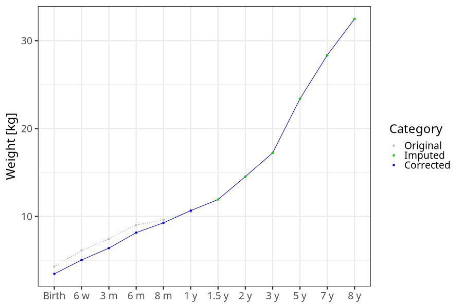
#### Most extreme example (3): 36885
> 

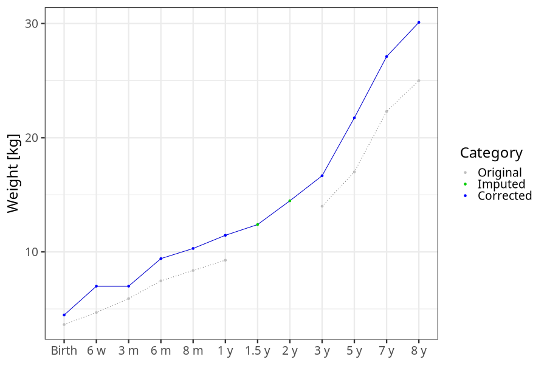
#### Most extreme example (4): 16448
> imputed@length_8m imputed@length_1y imputed@length_16m imputed@weight_8m imputed@weight_1y imputed@weight_16m
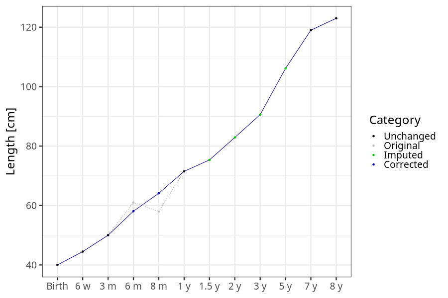

#### Most extreme example (5): 49885
> outlier@length_2y imputed@length_2y

#### Most extreme example (6): 34059
> 

#### Most extreme example (7): 34290
> imputed@weight_6m imputed@weight_8m imputed@weight_16m

#### Most extreme example (8): 73716
> imputed@length_16m imputed@length_2y imputed@weight_16m imputed@weight_2y

#### Most extreme example (9): 47241
> outlier@weight_1y imputed@weight_1y imputed@weight_2y

#### Most extreme example (10): 30886
> 

#### Most extreme example (11): 60681
> imputed@length_16m imputed@length_2y imputed@weight_16m imputed@weight_2y
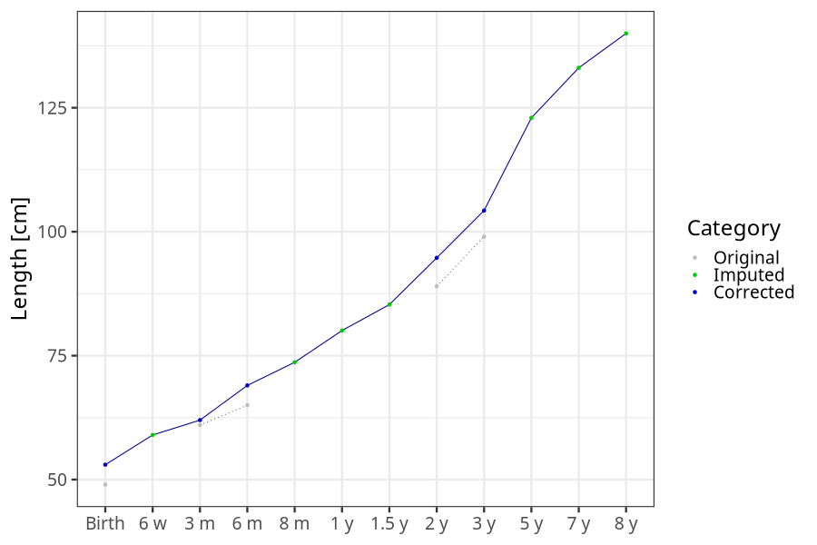

#### Most extreme example (12): 56912
> 
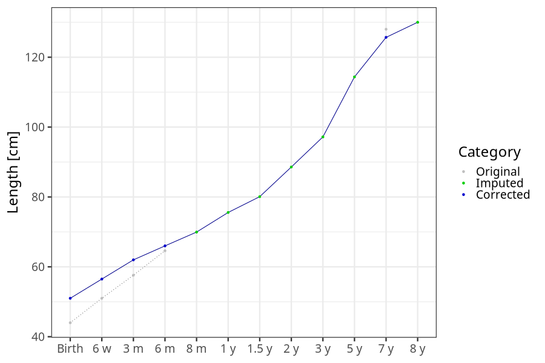
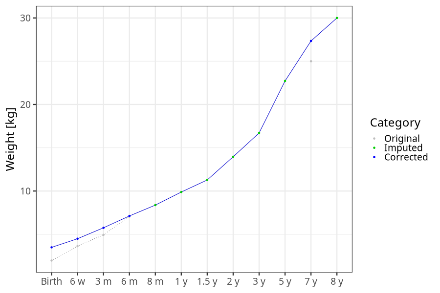
#### Most extreme example (13): 51649
> imputed@length_8m imputed@length_1y imputed@length_16m imputed@length_2y imputed@length_5y

#### Most extreme example (14): 38553
> imputed@length_16m imputed@weight_16m imputed@weight_5y

#### Most extreme example (15): 70871
> imputed@length_16m imputed@length_2y imputed@length_3y imputed@weight_16m imputed@weight_2y imputed@weight_3y

#### Most extreme example (16): 1302
> 

#### Most extreme example (17): 64888
> 

#### Most extreme example (18): 57887
> imputed@length_16m imputed@length_2y imputed@length_5y imputed@weight_16m imputed@weight_2y imputed@weight_5y outlier@weight_8y

#### Most extreme example (19): 74322
> 

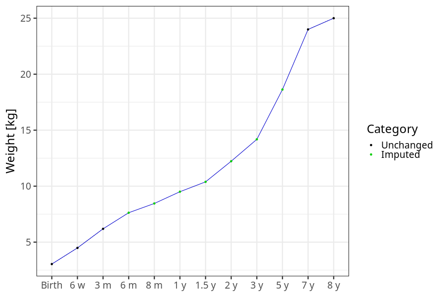
#### Most extreme example (20): 30369
> imputed@length_3y imputed@length_5y imputed@weight_3y imputed@weight_5y outlier@length_8y

