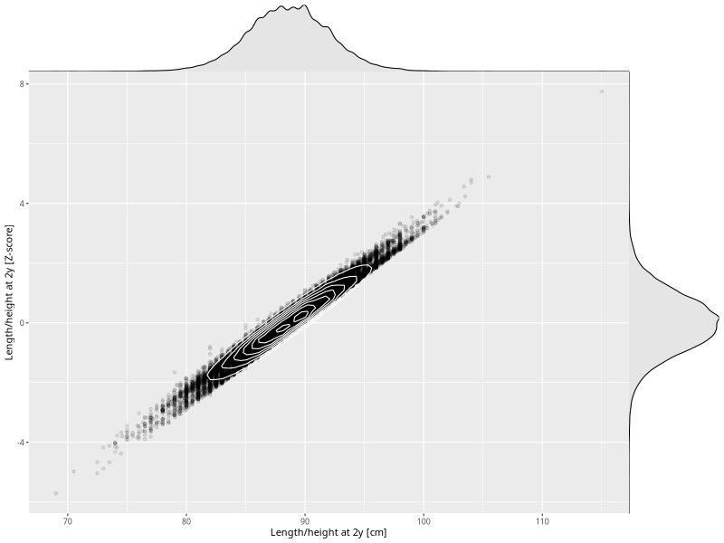

## Length/height at 2y

| Name | # Children | # Mothers | # Fathers | # Total |
| ---- | ---------- | --------- | --------- | ------- |
| length_2y | 41528 | 39463 | 29028 | 110019 |
| z_length_2y | 41528 | 39463 | 29028 | 110019 |

- Formula: `length_2y ~ fp(pregnancy_duration_1)`
- Sigma formula: ` ~ pregnancy_duration_1`
- Distribution: `NO`
- Normalization: `centiles.pred` Z-scores

