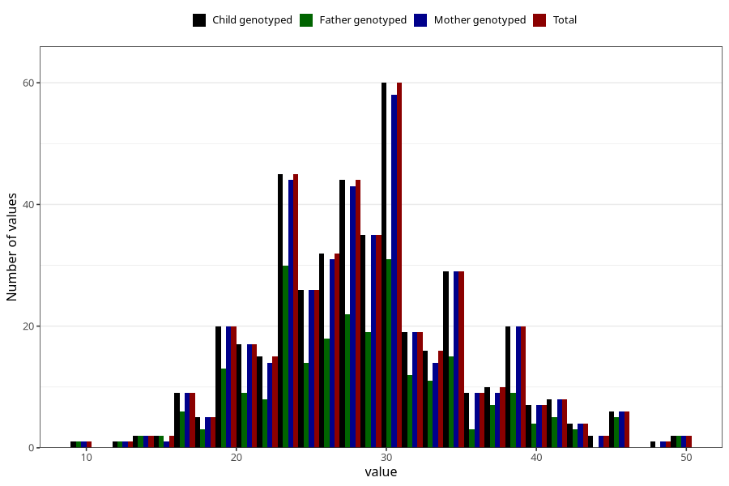

# body_fat_pct_wf
Variable mapping to `WK16` in `WF_Klinikkskjema_v12`.
- Number of values:

| Value | Total | Child genotyped | Mother genotyped | Father genotyped |
| ----- | ----- | --------------- | ---------------- | ---------------- |
| Missing | 74861 | 74861 | 71213 | 49829 |
| Non-missing | 447 | 447 | 437 | 255 |
| 25th percentile | 24 | 24 | 24 | 24 |
| 50th percentile | 29 | 29 | 29 | 28 |
| 75th percentile | 33 | 33 | 33 | 32.5 |
| Mean | 28.8165548098434 | 28.8165548098434 | 28.8421052631579 | 28.5176470588235 |
| Standard deviation | 6.66611764274543 | 6.66611764274543 | 6.67531830378029 | 7.02068669618334 |
| N | 447 | 447 | 437 | 255 |

