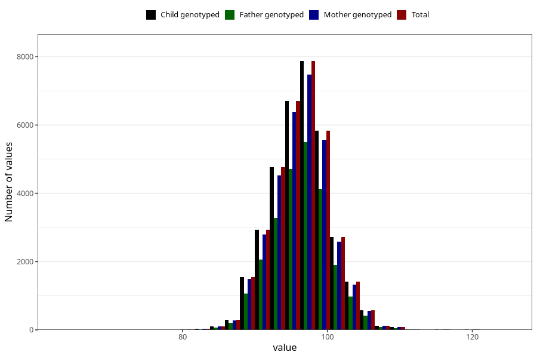

# length_3y
Variable mapping to `GG25` in `Skjema6_3aar_v12`.
- Number of values:

| Value | Total | Child genotyped | Mother genotyped | Father genotyped |
| ----- | ----- | --------------- | ---------------- | ---------------- |
| Missing | 40224 | 40224 | 38312 | 25566 |
| Non-missing | 35084 | 35084 | 33338 | 24518 |
| 25th percentile | 94 | 94 | 94 | 94 |
| 50th percentile | 97 | 97 | 97 | 97 |
| 75th percentile | 99 | 99 | 99 | 99 |
| Mean | 96.6314274313077 | 96.6314274313077 | 96.6326174335593 | 96.6479729178563 |
| Standard deviation | 3.96023196587806 | 3.96023196587806 | 3.96312082305726 | 3.94500553315282 |
| N | 35084 | 35084 | 33338 | 24518 |

