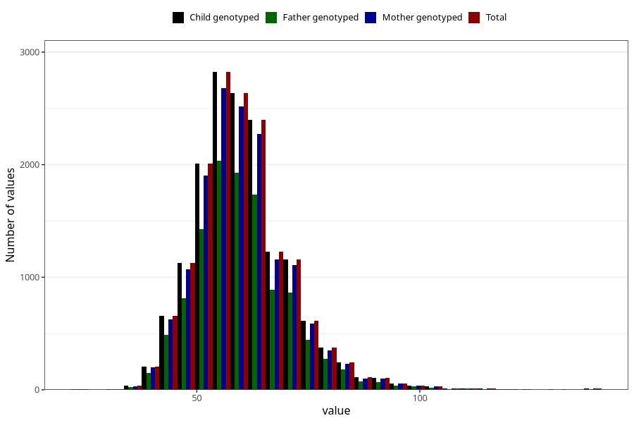

# weight_14c
Variable mapping to `UB221` in `Ungdomsskjema_Barn_v12_standard`.
- Number of values:

| Value | Total | Child genotyped | Mother genotyped | Father genotyped |
| ----- | ----- | --------------- | ---------------- | ---------------- |
| Missing | 59385 | 59385 | 56521 | 38545 |
| Non-missing | 15923 | 15923 | 15129 | 11539 |
| 25th percentile | 53 | 53 | 53 | 53 |
| 50th percentile | 59 | 59 | 59 | 60 |
| 75th percentile | 66 | 66 | 66 | 66 |
| Mean | 60.3902530930101 | 60.3902530930101 | 60.38251041047 | 60.3879018979114 |
| Standard deviation | 10.9809846014022 | 10.9809846014022 | 10.9615072509197 | 10.9201459886135 |
| N | 15923 | 15923 | 15129 | 11539 |

