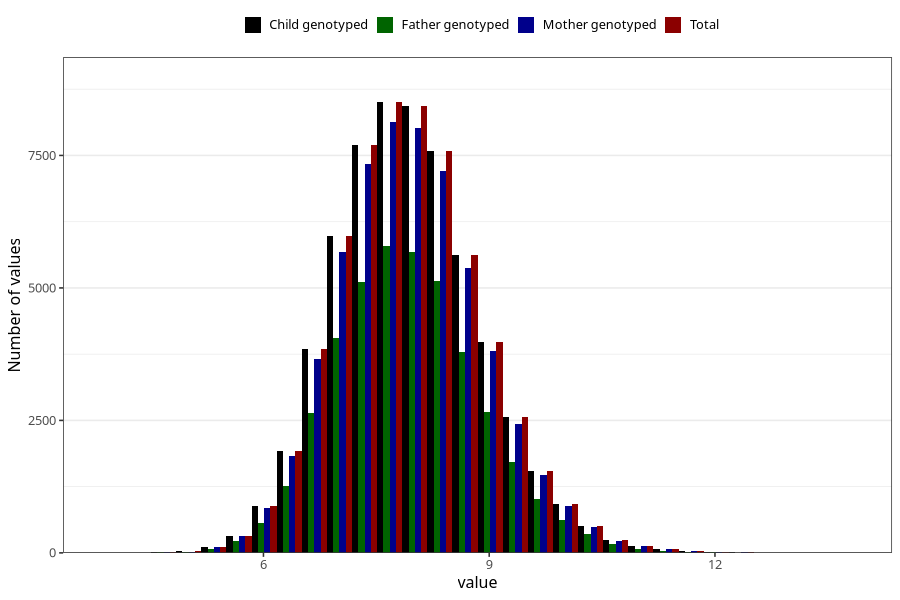

# weight_6m
Variable mapping to `DD224` in `Skjema4_6mnd_v12`.
- Number of values:

| Value | Total | Child genotyped | Mother genotyped | Father genotyped |
| ----- | ----- | --------------- | ---------------- | ---------------- |
| Missing | 14317 | 14317 | 13573 | 9025 |
| Non-missing | 60991 | 60991 | 58077 | 41059 |
| 25th percentile | 7.275 | 7.275 | 7.275 | 7.27 |
| 50th percentile | 7.89 | 7.89 | 7.89 | 7.89 |
| 75th percentile | 8.535 | 8.535 | 8.54 | 8.53 |
| Mean | 7.93862623993704 | 7.93862623993704 | 7.93868605472046 | 7.9365223458925 |
| Standard deviation | 0.95471233786393 | 0.95471233786393 | 0.954776964791958 | 0.951544624080722 |
| N | 60991 | 60991 | 58077 | 41059 |

