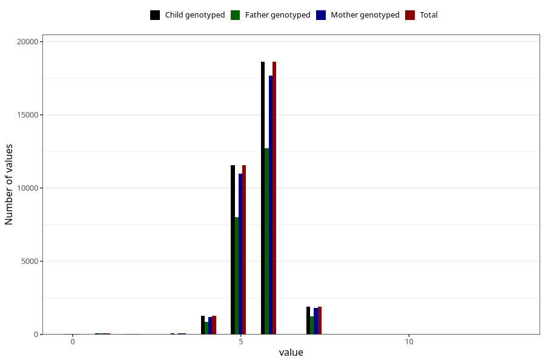

# age_lost_first_tooth_years
Variable mapping to `JJ332` in `Skjema7aar_v12`.
- Number of values:

| Value | Total | Child genotyped | Mother genotyped | Father genotyped |
| ----- | ----- | --------------- | ---------------- | ---------------- |
| Missing | 41713 | 41713 | 39717 | 27098 |
| Non-missing | 33595 | 33595 | 31933 | 22986 |
| 0 | 48 | 48 | 46 | 32 |
| 1 | 90 | 90 | 85 | 59 |
| 2 | 26 | 26 | 25 | 19 |
| 3 | 77 | 77 | 72 | 51 |
| 4 | 1273 | 1273 | 1204 | 866 |
| 5 | 11554 | 11554 | 10991 | 7992 |
| 6 | 18619 | 18619 | 17692 | 12726 |
| 7 | 1906 | 1906 | 1816 | 1241 |
| 8 | 1 | 1 | 1 | 0 |
| 13 | 1 | 1 | 1 | 0 |

