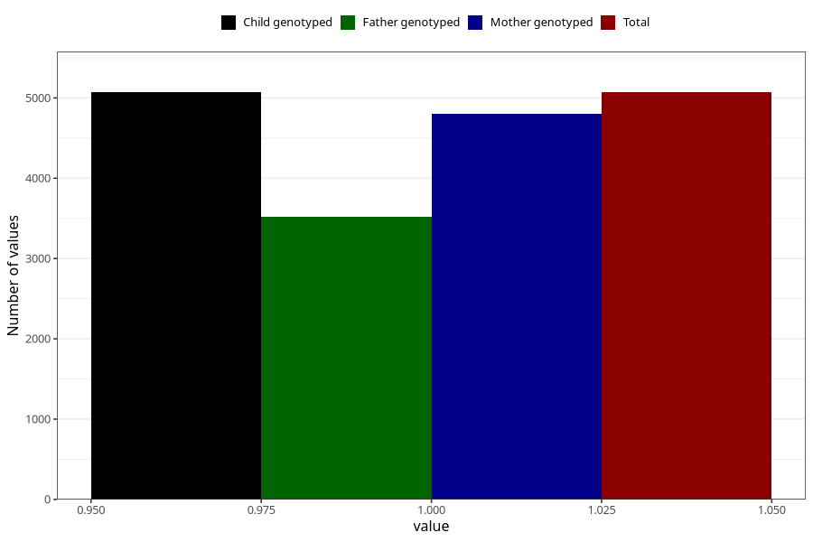

# atopic_eczema_yes_3y
Variable mapping to `GG78` in `Skjema6_3aar_v12`.
- Number of values:

| Value | Total | Child genotyped | Mother genotyped | Father genotyped |
| ----- | ----- | --------------- | ---------------- | ---------------- |
| Missing | 70238 | 70238 | 66852 | 46568 |
| Non-missing | 5070 | 5070 | 4798 | 3516 |
| 1 | 5070 | 5070 | 4798 | 3516 |

