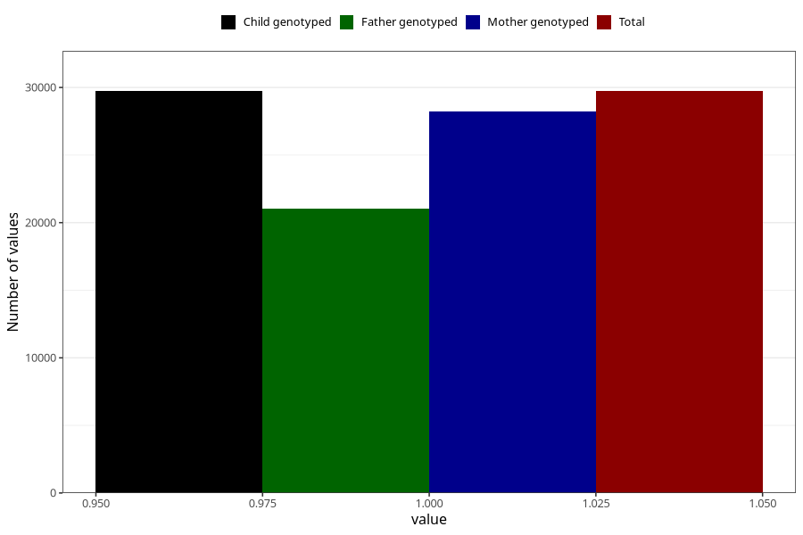

# autistic_traits_autism_Aspergers_syndrome_no_8y
Variable mapping to `NN52` in `Skjema8aar_v12`.
- Number of values:

| Value | Total | Child genotyped | Mother genotyped | Father genotyped |
| ----- | ----- | --------------- | ---------------- | ---------------- |
| Missing | 45579 | 45579 | 43452 | 29049 |
| Non-missing | 29729 | 29729 | 28198 | 21035 |
| 1 | 29729 | 29729 | 28198 | 21035 |

