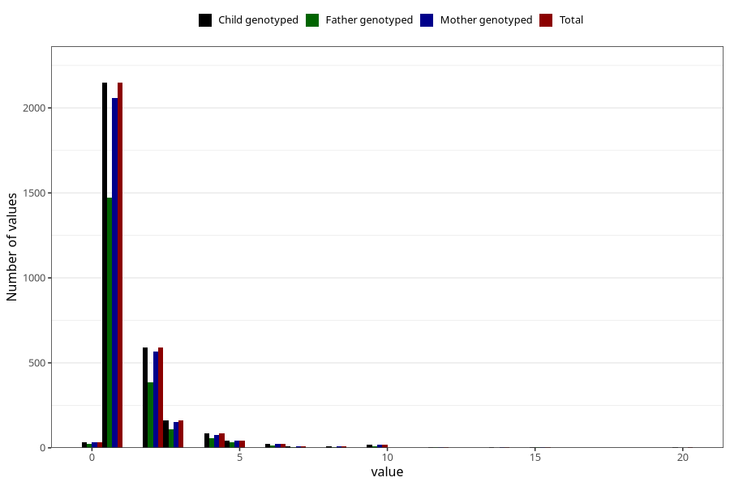

# bronchitis_freq_3y
Variable mapping to `GG144` in `Skjema6_3aar_v12`.
- Number of values:

| Value | Total | Child genotyped | Mother genotyped | Father genotyped |
| ----- | ----- | --------------- | ---------------- | ---------------- |
| Missing | 72181 | 72181 | 68657 | 47967 |
| Non-missing | 3127 | 3127 | 2993 | 2117 |
| 0 | 31 | 31 | 31 | 23 |
| 1 | 2148 | 2148 | 2057 | 1473 |
| 2 | 590 | 590 | 565 | 385 |
| 3 | 162 | 162 | 153 | 110 |
| 4 | 83 | 83 | 78 | 57 |
| 5 | 43 | 43 | 42 | 31 |
| 6 | 22 | 22 | 22 | 14 |
| 7 | 10 | 10 | 9 | 5 |
| 8 | 8 | 8 | 8 | 4 |
| 9 | 1 | 1 | 1 | 0 |
| 10 | 18 | 18 | 18 | 9 |
| 12 | 2 | 2 | 2 | 2 |
| 14 | 2 | 2 | 2 | 1 |
| 15 | 3 | 3 | 3 | 2 |
| 16 | 1 | 1 | 0 | 0 |
| 18 | 1 | 1 | 1 | 1 |
| 20 | 2 | 2 | 1 | 0 |

