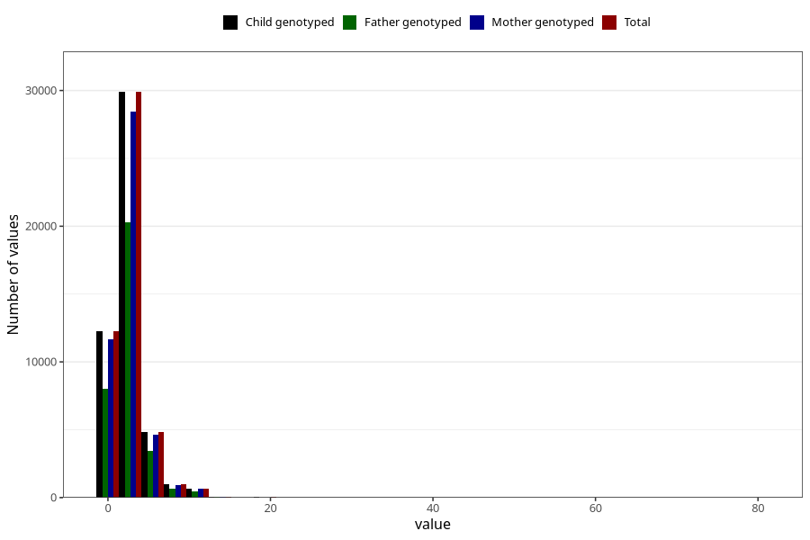

# common_cold_number_12_18m
Variable mapping to `EE218` in `Skjema5_18mnd_v12`.
- Number of values:

| Value | Total | Child genotyped | Mother genotyped | Father genotyped |
| ----- | ----- | --------------- | ---------------- | ---------------- |
| Missing | 26559 | 26559 | 25225 | 17126 |
| Non-missing | 48749 | 48749 | 46425 | 32958 |
| Filled in text or mark instead of number | 6 | 6 | 5 |6 |
| 25th percentile | 1 | 1 | 1 | 2 |
| 50th percentile | 2 | 2 | 2 | 2 |
| 75th percentile | 3 | 3 | 3 | 4 |
| Mean | 2.74564552858872 | 2.74564552858872 | 2.74670400689358 | 2.77876911871814 |
| Standard deviation | 1.92130321429678 | 1.92130321429678 | 1.91751166399593 | 1.94058531135729 |
| N | 48743 | 48743 | 46420 | 32952 |

