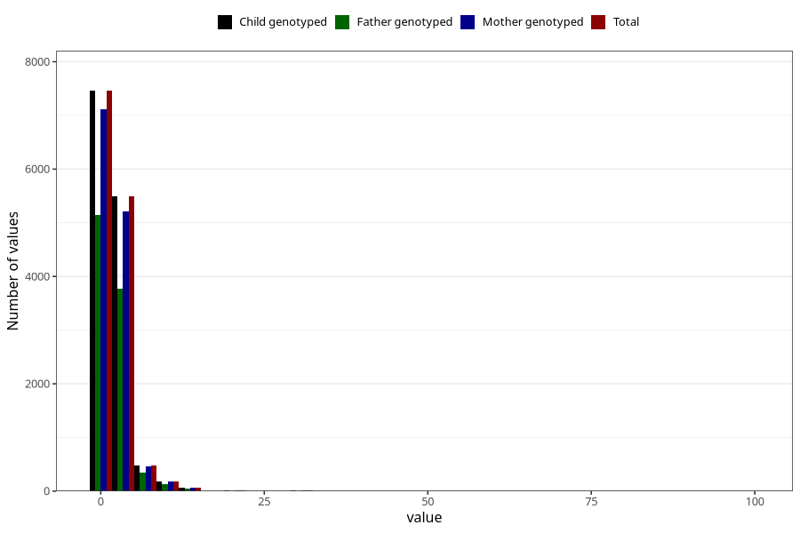

# ear_infection_freq_3y
Variable mapping to `GG138` in `Skjema6_3aar_v12`.
- Number of values:

| Value | Total | Child genotyped | Mother genotyped | Father genotyped |
| ----- | ----- | --------------- | ---------------- | ---------------- |
| Missing | 61595 | 61595 | 58605 | 40633 |
| Non-missing | 13713 | 13713 | 13045 | 9451 |
| 25th percentile | 1 | 1 | 1 | 1 |
| 50th percentile | 1 | 1 | 1 | 1 |
| 75th percentile | 2 | 2 | 2 | 2 |
| Mean | 2.13782542113323 | 2.13782542113323 | 2.13637408968954 | 2.11300391492964 |
| Standard deviation | 2.5944176163341 | 2.5944176163341 | 2.62729274435758 | 2.09325729866096 |
| N | 13713 | 13713 | 13045 | 9451 |

