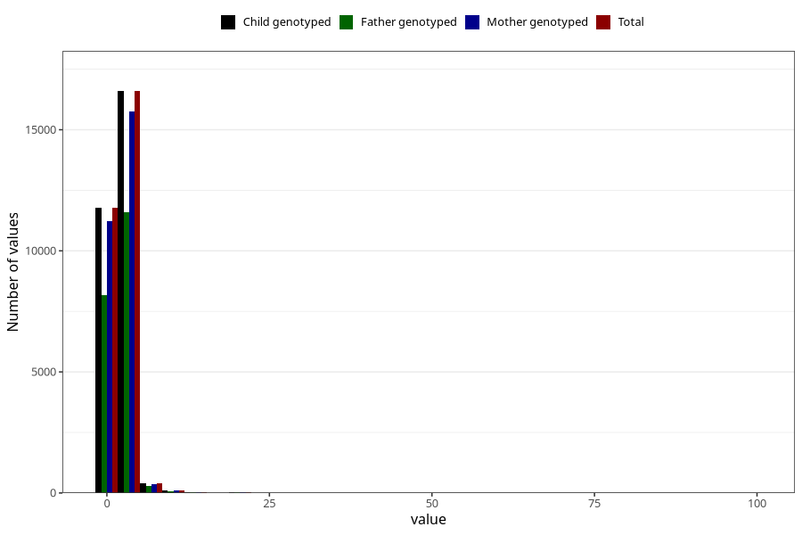

# gastric_flu_diarrhea_freq_3y
Variable mapping to `GG150` in `Skjema6_3aar_v12`.
- Number of values:

| Value | Total | Child genotyped | Mother genotyped | Father genotyped |
| ----- | ----- | --------------- | ---------------- | ---------------- |
| Missing | 46356 | 46356 | 44142 | 29919 |
| Non-missing | 28952 | 28952 | 27508 | 20165 |
| 25th percentile | 1 | 1 | 1 | 1 |
| 50th percentile | 2 | 2 | 2 | 2 |
| 75th percentile | 2 | 2 | 2 | 2 |
| Mean | 2.05284609008013 | 2.05284609008013 | 2.04845863021666 | 2.04954128440367 |
| Standard deviation | 1.99907706833644 | 1.99907706833644 | 1.99281076584335 | 1.77790764020849 |
| N | 28952 | 28952 | 27508 | 20165 |

