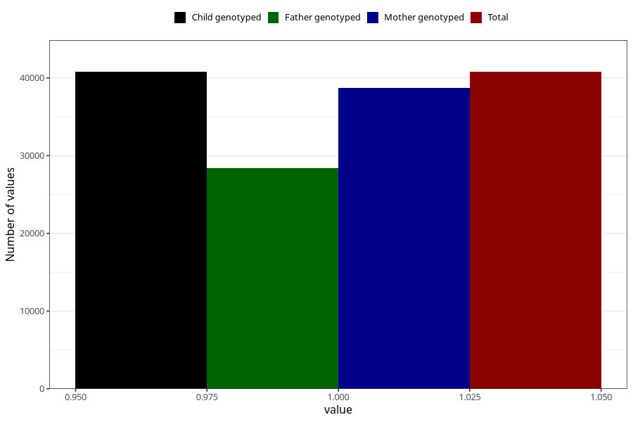

# heart_defect_no_3y
Variable mapping to `GG61` in `Skjema6_3aar_v12`.
- Number of values:

| Value | Total | Child genotyped | Mother genotyped | Father genotyped |
| ----- | ----- | --------------- | ---------------- | ---------------- |
| Missing | 34526 | 34526 | 32901 | 21672 |
| Non-missing | 40782 | 40782 | 38749 | 28412 |
| 1 | 40782 | 40782 | 38749 | 28412 |

