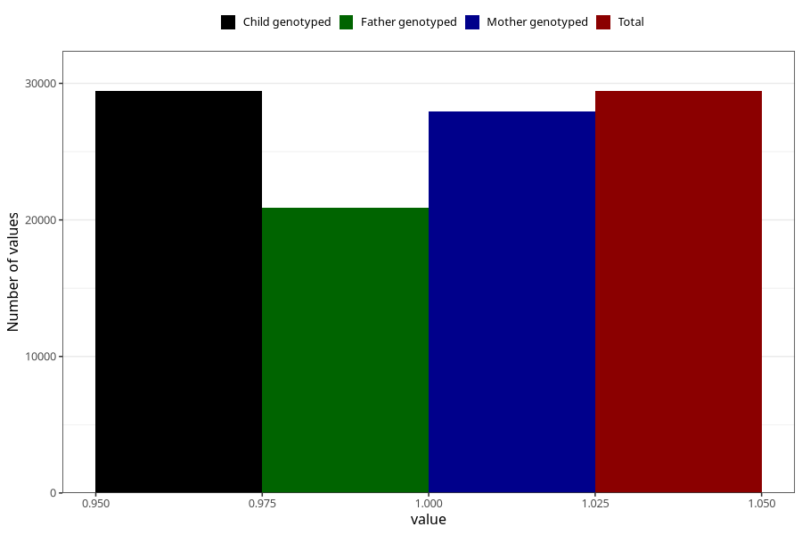

# hyperactivity_no_8y
Variable mapping to `NN44` in `Skjema8aar_v12`.
- Number of values:

| Value | Total | Child genotyped | Mother genotyped | Father genotyped |
| ----- | ----- | --------------- | ---------------- | ---------------- |
| Missing | 45876 | 45876 | 43715 | 29209 |
| Non-missing | 29432 | 29432 | 27935 | 20875 |
| 1 | 29432 | 29432 | 27935 | 20875 |

