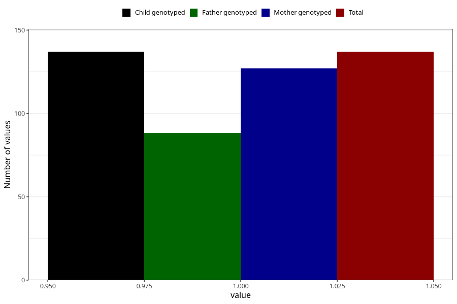

# hyperactivity_yes_3y
Variable mapping to `GG106` in `Skjema6_3aar_v12`.
- Number of values:

| Value | Total | Child genotyped | Mother genotyped | Father genotyped |
| ----- | ----- | --------------- | ---------------- | ---------------- |
| Missing | 75171 | 75171 | 71523 | 49996 |
| Non-missing | 137 | 137 | 127 | 88 |
| 1 | 137 | 137 | 127 | 88 |

