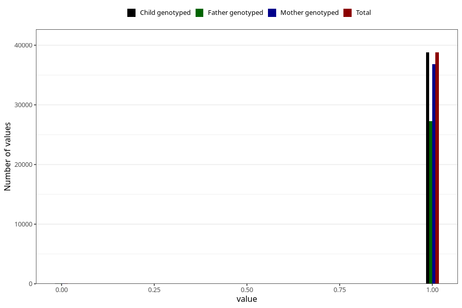

# other_gastrointestinal_problems_2_no_3y
Variable mapping to `GG574` in `Skjema6_3aar_v12`.
- Number of values:

| Value | Total | Child genotyped | Mother genotyped | Father genotyped |
| ----- | ----- | --------------- | ---------------- | ---------------- |
| Missing | 36455 | 36455 | 34754 | 22746 |
| Non-missing | 38853 | 38853 | 36896 | 27338 |
| 0 | 67 | 67 | 63 | 44 |
| 1 | 38786 | 38786 | 36833 | 27294 |

