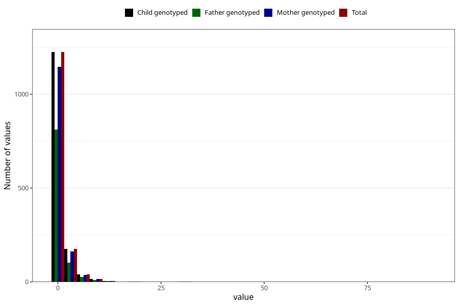

# other_number_6_11m
Variable mapping to `EE271` in `Skjema5_18mnd_v12`.
- Number of values:

| Value | Total | Child genotyped | Mother genotyped | Father genotyped |
| ----- | ----- | --------------- | ---------------- | ---------------- |
| Missing | 73833 | 73833 | 70269 | 49118 |
| Non-missing | 1475 | 1475 | 1381 | 966 |
| Filled in text or mark instead of number | 4 | 4 | 4 |4 |
| 0 | 122 | 122 | 115 | 80 |
| 1 | 1102 | 1102 | 1031 | 731 |
| 2 | 106 | 106 | 100 | 60 |
| 3 | 46 | 46 | 43 | 28 |
| 4 | 23 | 23 | 20 | 15 |
| 5 | 19 | 19 | 17 | 13 |
| 6 | 14 | 14 | 12 | 10 |
| 7 | 8 | 8 | 8 | 4 |
| 8 | 4 | 4 | 4 | 3 |
| 10 | 11 | 11 | 11 | 7 |
| 11 | 3 | 3 | 3 | 3 |
| 12 | 3 | 3 | 3 | 1 |
| 15 | 1 | 1 | 1 | 1 |
| 20 | 3 | 3 | 3 | 2 |
| 25 | 1 | 1 | 1 | 1 |
| 30 | 2 | 2 | 2 | 2 |
| 40 | 1 | 1 | 1 | 0 |
| 50 | 1 | 1 | 1 | 1 |
| 90 | 1 | 1 | 1 | 0 |

