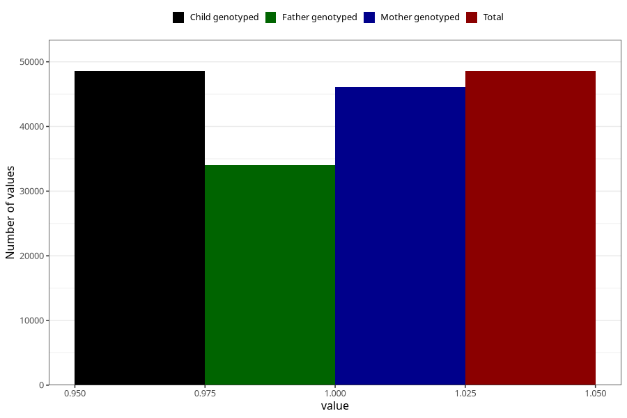

# testicles_not_descended_into_scrotum_no_18m
Variable mapping to `EE819` in `Skjema5_18mnd_v12`.
- Number of values:

| Value | Total | Child genotyped | Mother genotyped | Father genotyped |
| ----- | ----- | --------------- | ---------------- | ---------------- |
| Missing | 26764 | 26764 | 25543 | 16041 |
| Non-missing | 48544 | 48544 | 46107 | 34043 |
| 1 | 48544 | 48544 | 46107 | 34043 |

