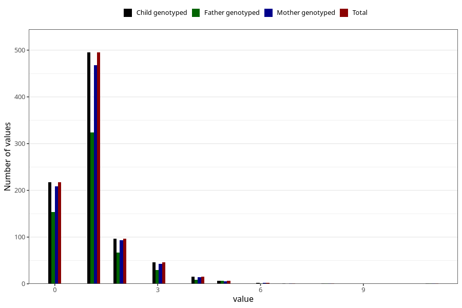

# urinary_tract_infection_number_6_11m
Variable mapping to `EE246` in `Skjema5_18mnd_v12`.
- Number of values:

| Value | Total | Child genotyped | Mother genotyped | Father genotyped |
| ----- | ----- | --------------- | ---------------- | ---------------- |
| Missing | 74428 | 74428 | 70814 | 49492 |
| Non-missing | 880 | 880 | 836 | 592 |
| 0 | 217 | 217 | 208 | 154 |
| 1 | 495 | 495 | 468 | 324 |
| 2 | 96 | 96 | 93 | 67 |
| 3 | 46 | 46 | 43 | 29 |
| 4 | 15 | 15 | 14 | 9 |
| 5 | 6 | 6 | 5 | 6 |
| 6 | 2 | 2 | 2 | 1 |
| 7 | 1 | 1 | 1 | 0 |
| 8 | 1 | 1 | 1 | 1 |
| 11 | 1 | 1 | 1 | 1 |

