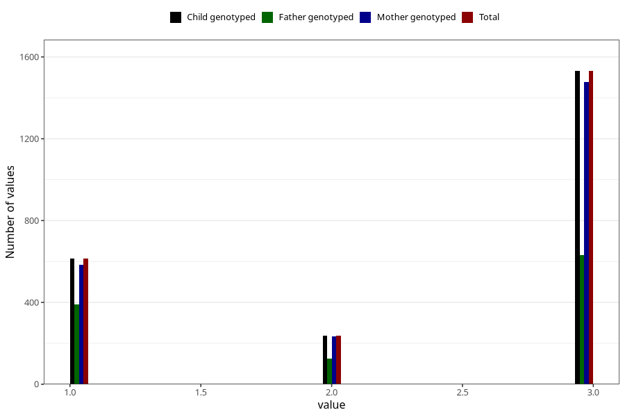

# vaccine_dt_freq_18m
Variable mapping to `EE154` in `Skjema5_18mnd_v12`.
- Number of values:

| Value | Total | Child genotyped | Mother genotyped | Father genotyped |
| ----- | ----- | --------------- | ---------------- | ---------------- |
| Missing | 72923 | 72923 | 69351 | 48936 |
| Non-missing | 2385 | 2385 | 2299 | 1148 |
| 1 | 615 | 615 | 585 | 389 |
| 2 | 239 | 239 | 235 | 126 |
| 3 | 1531 | 1531 | 1479 | 633 |

