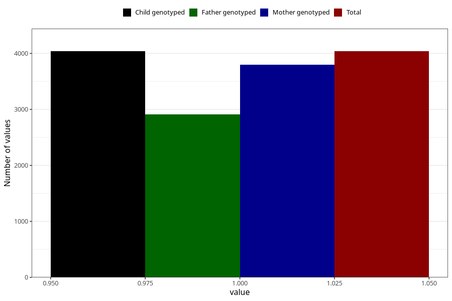

# fluorid_pills_5y
Variable mapping to `LL478` in `Skjema5aar_v12`.
- Number of values:

| Value | Total | Child genotyped | Mother genotyped | Father genotyped |
| ----- | ----- | --------------- | ---------------- | ---------------- |
| Missing | 71270 | 71270 | 67849 | 47173 |
| Non-missing | 4038 | 4038 | 3801 | 2911 |
| 1 | 4038 | 4038 | 3801 | 2911 |

